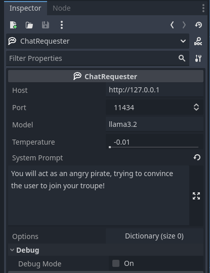
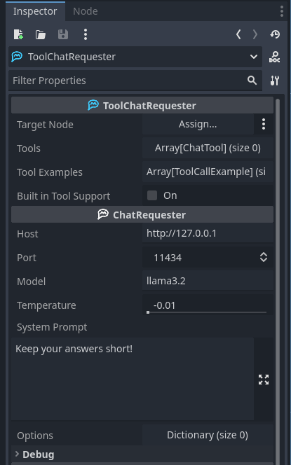

# Create applications with ollama in Godot
Gopilot Utils offers three Nodes made for easy interaction with your local ollama models right from within the Godot Game Engine!
### ChatRequester

Use the ChatRequester for chat, and single-turn interactions.  
The `generate()` and `send_message` methods make chatting a breeze!

[Here a guide on how to use this node](https://youtu.be/PbNknQh33p8)
### ToolChatRequester

You want your LLM to call functions? No problem! Use the ToolChatRequester to use ollamas tool calling functionalities!  
Simply provide the requester with a targer node, and a bunch of methods it should call, each with descriptions for its use and the list of required parameters.
### EmbedRequester

Want to dive deeper and use semantic similarily analysis for RAG applications? The EmbedRequester makes this easy, with just a few methods!
